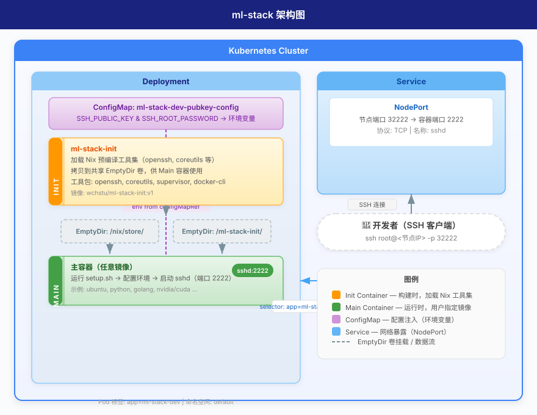

# ml-stack

基于 Kubernetes 的 ML 开发环境部署方案。通过 Helm chart 快速给**任意容器镜像**注入 SSH 访问能力，适合作为远程开发机或 GPU 开发环境的基础设施层。

## 架构概述



核心设计思路：

- **Init Container** 使用预编译的静态工具集（通过 Nix 编译 openssh、coreutils 等），挂载到 EmptyDir 共享卷中供业务容器使用。
- **Main Container** 不限制业务镜像——任意镜像（Python、Go、CUDA、Ubuntu 等）都能作为开发容器，启动后通过 setup.sh 初始化 SSH 环境并启动 sshd。
- **配置注入** 通过 ConfigMap 注入 SSH 公钥和 ROOT 密码，经环境变量传入容器。

## 项目结构

```
ml-stack/
├── charts/
│   └── ml-stack-dev/            # Helm chart
│       ├── Chart.yaml
│       ├── values.yaml
│       └── templates/
│           ├── deployment.yaml          # Deployment + InitContainer 定义
│           ├── service.yaml             # NodePort Service
│           └── ssh-pubkey-config.yaml   # SSH 公钥/密码 ConfigMap
├── container-images/
│   └── init/                     # Init 容器镜像构建
│       ├── Dockerfile
│       └── scripts/
│           ├── flake.nix         # Nix 依赖定义（openssh, supervisor 等）
│           ├── nix.conf          # Nix 镜像源配置（清华源）
│           ├── setup.sh          # 容器启动入口脚本
│           └── sshd_config       # SSH 服务端配置
└── flake.nix                     # 项目级 Nix flake
```

## 快速开始

### 前提条件

- Kubernetes 集群（本地 Minikube / Kind 或远程集群均可）
- Helm 3
- SSH 密钥对（或准备密码用于认证）

### 部署

`image.repository` 和 `image.tag` 可指定任意镜像。以下以 Ubuntu 22.04 为例：

**使用 SSH 公钥认证（推荐）：**

```bash
helm install ubuntu2204 charts/ml-stack-dev \
  --set ssh.pubkey="$(cat ~/.ssh/id_rsa.pub)" \
  --set image.repository=ubuntu \
  --set image.tag=22.04
```

**使用密码认证：**

```bash
helm install ubuntu2204 charts/ml-stack-dev \
  --set ssh.password="your-password" \
  --set image.repository=ubuntu \
  --set image.tag=22.04
```

**同时使用公钥 + 密码：**

```bash
helm install ubuntu2204 charts/ml-stack-dev \
  --set ssh.pubkey="$(cat ~/.ssh/id_rsa.pub)" \
  --set ssh.password="your-password" \
  --set image.repository=ubuntu \
  --set image.tag=22.04
```

### 连接

```bash
# 获取节点 IP
NODE_IP=$(kubectl get nodes -o jsonpath='{.items[0].status.addresses[0].address}')

# SSH 连接（端口 32222）
ssh root@$NODE_IP -p 32222
```

### 卸载

```bash
helm uninstall ubuntu2204
```

## 配置参考

Main Container 镜像完全由你指定，默认值是 `golang:1.22`，但你可以换成任何包含所需运行时的镜像：

| 示例场景 | image.repository | image.tag |
|---------|-----------------|-----------|
| Python 数据科学 | `python` | `3.12` |
| Go 开发 | `golang` | `1.22` (默认) |
| CUDA / GPU 开发 | `nvidia/cuda` | `12.4.0-base-ubuntu22.04` |
| 通用 Linux | `ubuntu` | `22.04` |

### values.yaml 关键参数

| 参数 | 默认值 | 说明 |
|------|--------|------|
| `image.repository` | `golang` | 主容器镜像仓库（任意镜像） |
| `image.tag` | `1.22` | 主容器镜像标签（任意 tag） |
| `service.type` | `NodePort` | 服务类型 |
| `service.port` | `2222` | 容器内 SSH 端口 |
| `service.nodePort` | `32222` | 节点暴露端口 |
| `ssh.pubkey` | `""` | SSH 公钥内容 |
| `ssh.password` | `"admin123"` | ROOT 密码 |
| `securityContext.runAsUser` | `0` | 以 root 运行 |

## 构建 Init 容器镜像

Init 容器通过 Nix 编译静态工具集，避免在 Ubuntu 容器内安装依赖，保证镜像体积和启动速度。

```bash
cd container-images/init
docker build -t wchstu/ml-stack-init:v1 .
docker push wchstu/ml-stack-init:v1
```

目前编译的工具包（参见 `flake.nix`）：

- **openssh** — SSH 服务端
- **coreutils** — 基础 shell 工具
- **supervisor** — 进程管理
- **inotify-tools** — 文件系统事件监听
- **docker** — Docker CLI
- **unzip** — 解压工具

Nix 源默认使用 [清华 TUNA 镜像](https://mirrors.tuna.tsinghua.edu.cn)，如需切换可修改 `nix.conf`。

## 开发

项目 Nix flake 提供统一的开发环境，进入项目后会自动加载：

```bash
# 进入开发 shell（需安装 Nix）
nix develop
```

Helm chart 修改后通过 `helm template` 验证渲染结果：

```bash
helm template charts/ml-stack-dev --debug
```

## 认证方式

| 方式 | 配置字段 | 启用条件 |
|------|---------|---------|
| SSH 公钥 | `ssh.pubkey` | 设置非空值即可 |
| 密码 | `ssh.password` | 设置非空值即可（需 `sshd_config` 开启 `PasswordAuthentication yes`）|

两个方式可同时启用，容器启动脚本 `setup.sh` 会根据环境变量按需配置。

## 安全说明

- 默认密码 `admin123` **仅适用于本地开发集群**，生产环境请务必修改。
- SSH 公钥认证优先推荐用于生产环境。
- Init 容器镜像包含的 Docker CLI 允许容器内 Docker 操作，建议配合 `docker.sock` 挂载使用。
```
